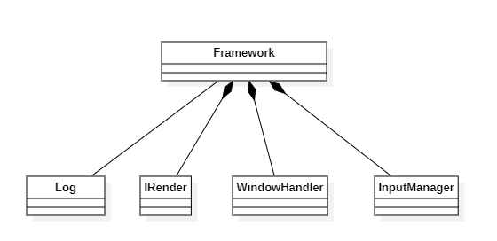
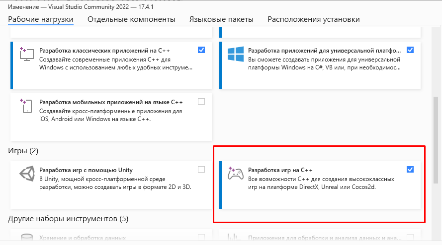

## Архитектура и понятие фреймворка

В рамках лабораторных работ Вы будете использовать и развивать фреймворк, позволяющий Вам отрисовывать 
что-либо в реальном времени.

Необходимость фреймворка заключается в избавлении от рутинных действий, отнимающих время, при изучении КГ, т.е. на плечи фреймворка возлагаются обязанности по созданию окна, его захвата, обработки событий ввода, выполнении полного цикла работы приложения, а также пользовательского кода и логгирования.

Важно, что архитектура фреймворка призвана в первую очередь сделать его минималистичным, чтобы не пугать и не путать своими размерами, благодаря чему его нельзя считать примером абсолютно правильной архитектуры.
С другой стороны, мы будем пытаться использовать хоть и самый минимум, но между тем необходимый уровень абстракций, которые используются в реальных фреймворках и библиотеках.

Также данная лабораторная работа является скорее ознакомительной - ваша задача ознакомиться с готовым фреймворком, чтобы впоследствии не было проблем при работе с ним.

### Устройство

Фреймворк будет состоять из 4-х модулей, исполняющих свои обязанности (Common, Util, Render и Input), объединенных в паттерн "Фасад/Facade". В случае, если Вы не знакомы с паттернами проектирования, то, упрощённо: "Фасад" - паттерн, предоставляющий пользователю и программисту единый облегчённый интерфейс для работы с многоуровневой или многомодульной системой. Другими словами, Вы получаете один единый интерфейс вместо набора интерфейсов подсистем.


Теперь чуть более подробно о самом устройстве фреймворка:

1. Common - отвечает за весь общий для проекта код, включая макросы и версионирование
2. Util - модуль, отвечающий за вспомогательные код, средства и инструменты
	2.1 Log - внутренний логгер фреймворка
3. Render - главный для нас модуль, потому что именно он отвечает за формирование и вывод изображения
	3.1 IRender - интерфейс, отвечающий за отрисовку
	3.2 WindowHandler - класс, отвечающий за создание и удержание окна Windows, в котором будет происходить отрисовка (по умолчанию, графические API не имеют функционала для создания окон и работы с ним, они могут лишь получать его от программиста)
4. Input - модуль, отвечающий за обработку событий ввода 
	4.1 InputListener - слушатель для событий (паттерн "Наблюдатель/Observer")
	4.2 InputManager - менеджер событий ввода; именно он отвечает за нахождение и обработку событий



## Внутренее представление

В рамках лабораторных работ используется IDE VS, поэтому Вам не придётся самим подтягивать всё необходимое, но в случае, если не распознаются заголовочные файлы и/или статические библиотеки DirectX, то необходимо доустановить вот такой вот модуль:




### Предкомпилированный заголовок

VS использует для ускорения сборки предкомпилированный заголовок, поэтому сформируем и его. Вставьте соответствующий код в Framework.h:

```c++

#pragma once

#include <clocale>
#include <ctime>

#include <string>
#include <list>

#define WIN32_LEAN_AND_MEAN
#include <windows.h>

#include <d3d11.h>

#pragma comment(lib, "d3d11.lib")

```

Директива ```#pragma once``` означает, что данный заголовочный файл, а именно всё, что идёт после данной директивы, должно быть включено только один раз (здесь стоит заметить, что это нестандартизированная директива, поэтому если вы будете собирать свой проект используя другой инструментарий (исключая g++ - он поддерживает), то могут возникнуть проблемы, - в таком случае достаточно заменить её на "Header guards").

На стандартных классах STL останавливаться не будем и пропустим их объяснение в виду того, что Вы должны быть с ними знакомы.
```#define WIN32_LEAN_AND_MEAN ``` означает, что из WinSDK нам необходимо подключить только самое необходимое, по требованию, чтобы проект не разрастался в размерах.

Заголовочный файл ```d3d11.h``` содержит все основные методы для работы с DirectX 11.

```#pragma comment``` директива, указывающая, что проекту необходимо прилинковать соответствующие статические библиотеки DirectX (Строго говоря, директива имеет более широкое значение, но нам необходимо именно это).

### Макросы и версия

Внутри файла ```Macros.hpp``` указаны макросы, которые упростят работу с кодом, а также версия фреймворка:

```c++ 

#define _DELETE(ptr)     { if (ptr) { delete (ptr);     (ptr) = nullptr; } }
#define _DELETE_ARR(ptr) { if (ptr) { delete[] (ptr);   (ptr) = nullptr; } }
#define _RELEASE(ptr)    { if (ptr) { (ptr)->Release(); (ptr) = nullptr; } }
#define _CLOSE(ptr)      { if (ptr) { (ptr)->Close(); delete (ptr); (ptr) = nullptr; } }

#define _VRSN_FRMWRK_ 0x01

```

Макросы нужны будут для более удобной очистки ресурсов, чтобы не писать каждый раз множество дополнительного кода - за Вас в это будут расширяться макросы. 
Макрос версии как таковой не используется, если это явно не будет сказано в дальнейшем - он нужен больше для того, чтобы дать понять каким примерно образом в рамках кода происходит версионирование в, например, коммерческих проектах (хотя строго говоря, там используется несколько более объёмный подход, но он формируется примерно по тому же принципу).

### Логгирование и класс Log

В фреймворке реализован очень простой, но достаточный для наших задач, синхронный логгер (при желании Вы можете потренироваться и написать полноценный асинхронный или же можете подключить любой другой на свое усмотрение), класс которого выглядит так:

```c++
namespace FRMWRK {
	enum class LOG_LEVEL {
		TRACE = 0x1,
		DEBUG = 0x2,
		INFO  = 0x3,
		WARN  = 0x4,
		ERR   = 0x5,
		FATAL = 0x6
	};

	class Log {
	private:
		static Log*    m_Instance;
		std::ofstream& m_FileHandler;

		void m_Init(void);
		void m_Close(void);
		void m_Log(void);
	public:
		Log(void);
		~Log(void);

		static Log* Get(void);

		void Write(LOG_LEVEL level, std::string msg);
	};

	#define TRACE(msg) Log::Get()->Write(TRACE, msg);
	#define DEBUG(msg) Log::Get()->Write(DEBUG, msg);
	#define INFO(msg)  Log::Get()->Write(INFO,  msg);
	#define WARN(msg)  Log::Get()->Write(WARN,  msg);
	#define ERROR(msg) Log::Get()->Write(ERR,   msg);
	#define FATAL(msg) Log::Get()->Write(FATAL, msg);
};
```

В рамках любых систем логгирования всегда (стоит понимать, что то, о чём здесь говорится - это классический подход - нередко им пренебрегают и реализуют по-другому: язык Go и его Log модуль как пример) существуют шесть уровней ошибок, перечисленные в ```LOG_LEVEL```, а также интерфейс для работы с самим логгером. Статическое инстанцирование позволяет Вам получать доступ к объекту во время его существования. Логика реализации приведена в ```Log.cpp```. С любым далее приводимым файлом реализации логики настоятельно предлагаю ознакамливаться для понимания работы, которую делают эти классы.

### Обработка событий ввода

В заголовочном файле ```InputCodes.hpp``` представлены коды клавиш и кнопок мыши, которые воспринимает WinAPI, фрагмент которого представлен ниже:

```c++
	enum class KEY_CODES {
		KEY_LBUTTON = 0x01, // ЛКМ
		KEY_RBUTTON = 0x02, // ПКМ

		KEY_CANCEL  = 0x03, // Control-break processing
		KEY_MBUTTON = 0x04, // СКМ 

		KEY_XBUTTON1 = 0x05, // X1 mouse button
		KEY_XBUTTON2 = 0x06, // X2 mouse button

		//...
	};
```

Большую часть из этого мы обрабатывать не будем, только самое основное. Но в будущем, в качестве дополнительного задания, можете привязать логику обработки дополнительных клавиш. Настоятельно лишь не рекомендую пытаться сходу использовать коды на IME, в виду его для Вас абстрактности.


В файле ```InputListener.hpp``` приведены классы, необходимые для обработки событий ввода, включая нажатия кнопок мыши и клавиш на клавиатуре. Также приведён прототип класса слушателя:

```c++
	// Класс-прототип для событий мыши
	struct MouseEvent {
		int m_x;
		int m_y;

		MouseEvent(int x, int y) : m_x(x), m_y(y) {}
	};

	// Событие клика мыши
	struct MouseEventClick : public MouseEvent {
		const MOUSE_KEY_CODES m_key;
		
		MouseEventClick(MOUSE_KEY_CODES key, int x, int y) : MouseEvent(x, y), m_key(key) {}
	};

	// Событие прокручивания колесиком мыши
	struct MouseEventScroll : public MouseEvent {
		int m_scroll;

		MouseEventScroll(int scroll, int x, int y) : MouseEvent(x, y), m_scroll(scroll) {}
	};

	// Событие нажатия на клавишу
	struct KeyEvent {
		const wchar_t   m_symb;
		const KEY_CODES m_key;

		KeyEvent(wchar_t symb, KEY_CODES key) : m_symb(symb), m_key(key) {}
	};

	// Слушатель для событий 
	class InputListener {
	public:
		virtual bool isMousePressed(const MouseEventClick& arg) {
			return false;
		}

		virtual bool isMouseReleased(const MouseEventClick& arg) {
			return false;
		}

		virtual bool isMouseScrolled(const MouseEventScroll& arg) {
			return false;
		}

		virtual bool isMouseMoved(const MouseEventClick& arg) {
			return false;
		}


		virtual bool isKeyPressed(const KeyEvent& arg) {
			return false;
		}

		virtual bool isKeyReleased(const KeyEvent& arg) {
			return false;
		}
	};
```

Обработчики событий крайне простые и нужны для отслеживания данных, которые они обрабатывают. В случае же слушателя: все методы виртуальные, т.к. от него мы будем наследоваться и их переопределять, но у каждого из них есть тело, возвращающее булево значение, по умолчанию - false, необходимое для того, что мы будем оперировать не одним слушателем, а их коллекцией, а обработка их будет вестись в порядке добавления, а не асинхронно, поэтому возврат true будет означать, что слушатель обработал данное событие и его обрабатывать уже не имеет смысла.

Далее следует класс ```InputManager```:

```c++
class InputManager {
	private:
		std::list<InputListener*> m_Listener;

		RECT m_WinRect;
		int  m_CursorX;
		int  m_CursorY;
		int  m_CursorScroll;

		// Событие движения курсора
		void m_EventMoveCursor(void);
		// Событие клавиши мыши
		void m_EventMouseKey(const MOUSE_KEY_CODES key, bool isPressed);
		// Событие вращения колесика мыши
		void m_EventMouseScroll(int scroll);
		// Событие клавиши
		void m_EventMouseKey(const KEY_CODES key, wchar_t symb, bool isPressed);	
	public:
		void Init(void);
		void Close(void);

		void Run(const UINT& msg, WPARAM wParam, LPARAM lParam);

		void AddListener(InputListener* listener);

		void SetWinRect(const RECT& rect);
	};
```

Он занимается оповещением всех слушателей о возникновении события, которые поступают от окна. Обработку мы будем делать через WinAPI, а не через Direct Input в силу того, что Microsoft не рекомендует использовать последний, так как он устарел.
Вся логика работы менеджера ввода, упрощённо, - получаем событие, вызываем нужные методы своих слушателей. 
Из названий и комментариев, думаю, назначение понятно, поэтому остановимся отдельно только на SetWinRect - этот метод выдает менеджеру информацию о положении и размерах окна, которые необходимы для получения координат мыши, т.к. WinAPI получает их на самом экране, а не в отдельном окне, в виду чего менеджер будет следить, чтобы координаты были именно оконными.

Внутренние закрытые методы описывают события и обрабатывают их соответствующим образом. Все они вызываются в методе Run.
Логика описана в файле ```InputManager.cpp```.

## Рендер

В файле ```IRender.hpp``` вводится интерфейс рендера, который и будет нашей основной целью при изучении DirectX.

```c++
	class IRender {
	protected:
	public:
		IRender(void);

		virtual bool Init(HWND hwnd) = 0;
		virtual bool Draw(void)      = 0;
		virtual void Close(void)     = 0;

		virtual ~IRender(void);
	};
```

По своему устройству он пока крайне прост и содержит сугубо виртуальные методы, включая три чистых виртуальных метода, которые будут определяться нами позднее при использовании фреймворка.

Здесь все крайне просто: Init - метод, который мы будем перегружать для инициализации рендера, Draw - будет заниматься отрисовкой и Close - очищать ресурсы после использования.

## Фреймворк

Класс фреймворка представляет собой "Фасад", что позволит нам проще работать с фреймворком.
Описание класса представлено в файле ```Framework.hpp```

```c++
	class Framework {
	protected:
		bool CalculateFrame(void);

		Window*       m_WndInst;
		IRender*      m_Render;
		InputManager* m_InputMgr;
		Log	          m_Log;

		bool          m_isInit;
	public:
		Framework(void);
		
		bool Init(void);
		void Run(void);
		void Close(void);

		void SetRender(IRender* render);
		void AddInputListener(InputListener* listener);

		~Framework(void);
	};
```

Методы Init, Run и Close имеют говорящие названия, поэтому описывать их не будем.
Методы SetRender и AddInputListener выполняют функции установки рендера для фреймворка и добавлений слушателей событий в менеджер ввода, соответственно.

Помимо этого, класс содержит инстанс окна, в котором отрисовывает и экземпляр логгера, который поможет Вам понять где скрылась ошибка при лабораторных работах (режим дебаггинга тоже может помочь, но запомните, что в больших и объёмных проектах его используют селективно, т.е. уже зная где искать ошибку - он не призван вам помочь найти модуль, в котором эта ошибка сокрыта: в рамках больших и средних проектов это долгая задача, которая отнимает драгоценное время на разработку, поэтому привыкайте использовать логгеры и правильно с ними работать).

Метод CalculateFrame описывает весь жизненный цикл окна: отлавливая события окна и отрисовывая через рендер то, что Вам необходимо.

Теперь Ваша задача собрать данный проект (собрать, но не запускать - помните, что Вы не сможете запустить статическую библиотеку, так как это не исполняемый файл). Если всё собралось без ошибок, то в следующих лабораторных Вам понадобится подключать эту библиотеку к своим проектам.