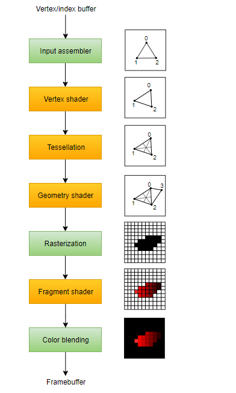

## Первый проект и отрисовка треугольника

В рамках данной лабораторной работы Вам нужно будет отрисовать самый простой примитив - треугольник. Отрисовывать мы его будем сразу в трёхмерном пространстве, для простоты, но не будем вводить буфер глубины, благодаря чему и не получим трёхмерное изображение.

### Тестирование работы фреймворка и проекта

Возьмите проект для первой лабораторной работы с репозитория и пропишите в файле ```CG_2.cpp``` следующее:

```c++
	#include <iostream>

	#include "CGF.hpp"
	#include "InputListener.hpp"

	#include "Render.hpp"

	using namespace FRMWRK;

	// Тестовый класс расширяющий прототип слушателя для обработки нажатий
	class TestInput : public InputListener {
	public:
		// Не забывайте, что всё наследуемое в С++ может быть как перегружено, так и перекрыто
		//  используйте override для переопределения логики
		bool isKeyPressed(const KeyEvent& arg) override {
			printf("Pressed key: [%c]\n", arg.m_symb);
			return false;
		}

		bool isMouseMoved(const MouseEvent& arg) override {
			printf("Mouse position is {X = %d} - {Y = %d}\n", arg.m_x, arg.m_y);
			return false;
		}
	};

	// Тестовый класс рендерера, необходим как заглушка 
	class TestRender : public IRender {
	public:
		bool Init(HWND nwnd) { return true; }
		bool Draw(void)      { return true; }
		void Close(void)     { }
	};


	int main(int argc, char* argv[]) {
		Framework framework;                        // Создаём фреймворк и цепляем к нему тестовые модули

		TestRender* render = new TestRender();
		TestInput*  input  = new TestInput();

		framework.SetRender(render);
		framework.Init();
		framework.AddInputListener(input);

		framework.Run();

		framework.Close();

		return 0x0;
	}
```

По итогу Вы должны получить окно приложения, залитое одним цветом и консоль, в которую будет выводиться вся информация о нажатиях на клавиши и позиции указателя мыши.

### Фреймворк

Для начала нам понадобится обновить фреймворк, внеся в него некоторые изменения (здесь и далее в лабораторных работах, если приводится ```//...```, то это означает, что уже имеется код с прошлой лабораторной работы, к которому необходимо добавить новый, если не оговорено иное):

```c++
	class IRender {
	protected:
		D3D_DRIVER_TYPE         m_DriverType;			// Объект перечисления поддержки D3D компьютером
		D3D_FEATURE_LEVEL       m_FeatureLevel;			// Объект перечисления уровней Direct3D устройства
		ID3D11Device*           m_D3DDevice;			// Устройство
		ID3D11DeviceContext*    m_ImmediateContext;	    // Контекст
		IDXGISwapChain*         m_SwapChain;			// Swap chain
		ID3D11RenderTargetView* m_RenderTargetView;	    // Объект заднего буфера
	public:
		//...

		bool CreateDevice(HWND hwnd);	// Метод для инициализации DirectX

		void BeginFrame(void);			// Методы для формирования буфферов
		void EndFrame(void);			// и вызова смены swap-chain'а
		
		void Shutdown(void);	        // Метод для очистки ресурсов

		//...
	};
```

Теперь о том, что же всё это означает. 
Абсолютно всё в DirectX строится вокруг устройства (Device) - это некоторый виртуальный адаптер вашего отрисовывающего устройства, притом он может быть как реальным, т.е. видеокартой, так и некоторой программной эмуляцией. Устройство DirectX необходимо потому, что именно оно вводит для Вас унифицированный интерфейс работы с физическими устройствами (другими словами: иначе Вам бы пришлось писать код под каждую видеокарту, или семейство видеокарт, отдельно).
Контекст устройства (Device context) - программная прослойка, отвечающая за отрисовку, а именно за выполнение команд отрисовки и настройку пайплайна (об этом чуть позднее). Начиная с одиннадцатой версии существует два вида контекста: немедленный (Immediate) и отложенный (Deferred). Немедленный исполняет команды сразу, как они поступают. Каждое устройство может иметь только один немедленный контекст. В случае же отложенного команды будут собираться в буфер и после обрабатываться немедленным контекстом. В лабораторных работах мы будем использовать только немедленный.
Тип драйвера и уровни устройства необходимы для указания типа устройства и указания допустимого уровня функций, которое устройство поддерживает.
Цель отрисовки (Render Target) указывает на буфер, в который мы отрисовываем - это может быть как пиксельный буфер для отрисовки, так и, например, текстура.

Методы начала и окончания кадров нужны для работы так называемого swap-chain - это технология, которая разбивает изображение на два буфера: первый Вы видите как законченное, с точки зрения отрисовки, изображение, а второй необходим для отрисовки в него в этот момент следующего кадра, после чего буферы меняются ролями. И так на постоянной основе.

Также нам потребуется изменить логику работы ранее имевшихся методов и написать её для новых. В файле ```IRender.cpp```, в конструкторе класса укажите для типа драйвера константу ```D3D_DRIVER_TYPE_NULL``` и константу ```D3D_FEATURE_LEVEL_11_0``` для объекта поддержки уровней устройства. Для всего остального установите ```nullptr```.

Теперь нужно указать каким образом создавать устройство

```c++
bool IRender::CreateDevice(HWND hwnd) {
		HRESULT sc = S_OK;

		RECT rc;                                 
		GetClientRect(hwnd, &rc);
		UINT width  = rc.right  - rc.left;  // Получаем реальную ширину и высоту окна
		UINT height = rc.bottom - rc.top;

		UINT createDeviceFlags = 0x0;       // Указываем с какими флагами создавать устройство
#ifdef _DEBUG
		createDeviceFlags |= D3D11_CREATE_DEVICE_DEBUG;
#endif

		// Указываем тип устройства
		D3D_DRIVER_TYPE driverTypes[] = { D3D_DRIVER_TYPE_HARDWARE,
										  D3D_DRIVER_TYPE_WARP,
										  D3D_DRIVER_TYPE_REFERENCE };
		UINT numDriverTypes = ARRAYSIZE(driverTypes);

		// .. и его уровни поддержки DX
		D3D_FEATURE_LEVEL featureLevels[] = { D3D_FEATURE_LEVEL_11_0,
											  D3D_FEATURE_LEVEL_10_1,
											  D3D_FEATURE_LEVEL_10_0 };
		UINT numFeatureLevels = ARRAYSIZE(featureLevels);

		// Создаём и описываем swap-chain
		DXGI_SWAP_CHAIN_DESC sd;
		ZeroMemory(&sd, sizeof(sd));
		sd.BufferCount                        = 0x1;                             // Количество задних буферов
		sd.BufferDesc.Width                   = width;                           // Его ширина
		sd.BufferDesc.Height                  = height;                          // и высота
		sd.BufferDesc.Format                  = DXGI_FORMAT_R8G8B8A8_UNORM;      // Формат пикселя
		sd.BufferDesc.RefreshRate.Numerator   = 0x3C;                            // 0x3C == 60 (Частота обновления)
		sd.BufferDesc.RefreshRate.Denominator = 0x1;
		sd.BufferUsage                        = DXGI_USAGE_RENDER_TARGET_OUTPUT; // Назначение буфера 
		sd.OutputWindow                       = hwnd;                            // Дескриптор окна
		sd.SampleDesc.Count                   = 0x1;
		sd.SampleDesc.Quality                 = 0x0;
		sd.Windowed                           = TRUE;                            // Оконный режим

		// Перебираем по всем ранее указанным возможным типам устроуства 
		for (UINT driverTypeIndex = 0; driverTypeIndex < numDriverTypes; driverTypeIndex++) {
			m_DriverType = driverTypes[driverTypeIndex];

			// Пытаемся создать устройство и swap-chain
			sc = D3D11CreateDeviceAndSwapChain(nullptr, m_DriverType, 
											   nullptr, createDeviceFlags, 
											   featureLevels, numFeatureLevels, 
											   D3D11_SDK_VERSION, &sd, &m_SwapChain, 
											   &m_D3DDevice, &m_FeatureLevel, &m_ImmediateContext);

			if (SUCCEEDED(sc)) {
				break;
			}
		}

		// Проверяем было ли устройство создано хотя бы для чего-нибудь
		if (FAILED(sc)) {
			return false;
		}

		// Создаём задний буфер 
		ID3D11Texture2D* pBackBuffer = nullptr;
		sc = m_SwapChain->GetBuffer(0x0, __uuidof(ID3D11Texture2D), (LPVOID*)&pBackBuffer);
		if (FAILED(sc)) {
			return false;
		}

		// Создаём из полученного буфера render target
		sc = m_D3DDevice->CreateRenderTargetView(pBackBuffer, nullptr, &m_RenderTargetView);
		CG_RELEASE(pBackBuffer);
		if (FAILED(sc)) {
			return false;
		}

		// Привязываем render target к пайплайну, указывая соответственно цель для отрисовки
		m_ImmediateContext->OMSetRenderTargets(0x1, &m_RenderTargetView, nullptr);

		// Создаём вьюпорт, который будет определять зону, в которой мы рисуем
		D3D11_VIEWPORT vp;
		vp.Width    = (FLOAT)width;
		vp.Height   = (FLOAT)height;
		vp.MinDepth = 0.0f;
		vp.MaxDepth = 1.0f;
		vp.TopLeftX = 0x0;
		vp.TopLeftY = 0x0;
		m_ImmediateContext->RSSetViewports(0x1, &vp);

		return Init(hwnd);
	}	
```

То есть весь процесс инициализации DirectX всегда одинаков:

	1. Описываете swap-chain, заполняя структуру DXGI_SWAP_CHAIN_DESC
	2. Создаёте интерфейсы ID3D11Device и IDXGISwapChain
	3. Создаёте render target для заднего буфера swap-chain
	4. Создаёте буфер глубины/шаблона (stencil) и связываете его с depth/stencil view (этот шаг мы пока не делали)
	5. Привязываете render target и depth/stencil view к конвееру рендеринга, чтобы Direct3D мог их использовать.
	6. Установливаете вьюпорт

Осталось всего несколько изменений:

```c++
	void IRender::BeginFrame(void) {
		float ClearColor[0x4] = { 0.0f, 0.0f, 0.0f, 1.0f };
		m_ImmediateContext->ClearRenderTargetView(m_RenderTargetView, ClearColor);
	}

	void IRender::EndFrame(void) {
		m_SwapChain->Present(0x0, 0x0);
	}

	void IRender::Shutdown(void) {
		Close();

		if (m_ImmediateContext) {
			m_ImmediateContext->ClearState();
		}

		CG_RELEASE(m_RenderTargetView);
		CG_RELEASE(m_SwapChain);
		CG_RELEASE(m_ImmediateContext);
		CG_RELEASE(m_D3DDevice);
	}
```

Здесь возникнуть проблем с пониманием уже не должно: в ```BeginFrame``` мы формируем вид буфера, заливая его чёрным цветом, а в ```EndFrame``` - отрисовываем. Метод ```Shutdown``` очищает ресурсы после использования рендера. 

Понадобится также внести изменения в класс фреймворка, а именно: заменить в методе ```Init``` вызов метода Init у модуля m_Render на 
```c++
	if (!this->m_Render->CreateDevice(m_WndInst->GetHWND())) {
``` 

В методе ```CalculateFrame``` добавить вызовы формирования кадра к вызову отрисовки:
```c++
	m_Render->BeginFrame();
	if (!this->m_Render->Draw()) {
		return false;
	}
	m_Render->EndFrame();
```

А также в методе ```Close``` фреймворка заменить ```CG_CLOSE(this->m_Render)``` на 
```с++
	this->m_Render->Shutdown();
	CG_DELETE(this->m_Render)
```

## Отрисовка треугольника

Не забудьте закомментировать или удалить ранее написанный код для тестирования работы проекта. Оставьте только код в функции main - он останется почти без изменений - достаточно из него исключить обработку нажатий, потому что в данной лабораторной работе их не будет.

### Вводим понятие треугольника

Любой трёмерный объект описывается посредством вершин (Vertex), которые в самом простом виде представляют из себя значение координат, которую имеет данная вершина. Иными словами, например - три вершины с уникальными, друг относительно друга координатами, описывают для данного трёхмерного пространства треугольник.

Создайте заголовочный файл, описывающий вершину - в моём случае ```Vertex.hpp``` и напишите в нём:

```c++
#include <directxmath.h>

namespace {
	struct Vertex {
		DirectX::XMFLOAT3 Position;
	};
};
```

Заголовочный файл ```directxmath.h``` описывает всю математику, необходимую для взаимодействия трёхмерных объектов и их отрисовки. У него есть специфические названия для методов и объектов: это связано с тем, что ранее существовал фреймворк XNA, который Microsoft® всячески продвигала и теперь вся математика DirectX это математика существовавшего ранее ```xnamath.h```. Поэтому если будете искать информацию в интернете и наткнетесь на использование данного заголовка - не пугайтесь - ранее это было нормой. 
Помимо прочего, математика в DirectX, как и по-сути в любой другой математической библиотеке для 3D графики оперирует уже готовыми примитивами, представляющими собой коллекции значений типа float под 2-, 3- и 4-мерные размерности. Отсюда и название ```XMFLOAT3```: в структуре хранится три значения типа float, для описания каждой компоненты.  

Разумеется у вершины может быть куда больше параметров - нормаль, цвет, текстурная координата и т.д.
Но пока мы эти аспекты затрагивать не будем.

Любая структура вершин задаёт их формат и размеры, которые впоследствии обрабатываются на GPU. Но GPU понадобится из этого среза памяти получить нужные ей данные, что достигается использованием входного формата или ```Input Layout```. Данный формат нужен для представления структуры в понятном для видеокарты виде.
В рамках DirectX для этого существует интерфейс ```ID3D11InputLayout```, который мы и будем использовать. Помимо этого к входному формату будут применены ещё и пиксельный и вершинный шейдер.

## Programing graphics pipeline (PGP)

Но перед тем как писать код для отрисовки изображения, следует разобраться с архиважным понятием для компьютерной графики - конвейером отрисовки, он же графический конвейер.

ГК - набор программно-аппаратных средств для преобразования описания объектов в матрицу ячеек памяти дисплейного устройства. Его основная задача сформировать из поданного ему описания иллюзию трёхмерного изображения, поэтапно применяя определённую обработку к этим самым данным.
Другое определение, которое можно дать: ГК - последовательность операций, преобразующих вершины и текстуры трёхмерного объекта в пиксели.

Ниже дана упрощённая схема ГК в API Vulkan:



На первом его этапе сборищик входных данных (IA) собирает данные примитивов (точек, линий и/или треугольников), после чего передаёт их вершинному шейдеру (VS), который вызывается для каждой вершины и трансформирует её в соответствии с логикой шейдера (преобразование, скиннинг, морфирование или освещение). 
Шейдеры тесселяции (TS), как третий этап конвейера, расширяю полигональную сетку в более подробные примитивы на GPU с помощью дополнительного разбиения геометрии, в случае если это необходимо, и передаёт данные в геометрический шейдер (GS), вызывающийся уже для каждого примитива (точки, треугольника и линииЖ здесь стоит уточнить, что в отличии от VS, геометрический шейдер работает сразу над всеми вершинами примитива, т.е.: одна для точки, две для линии и три для треугольника) отменяя их отрисовку или генерируя новые примитивы.
Последующий этап растеризации является уже первым именно этапом отрисовки, где каждый из примитивов разбивается на фрагменты - пиксельные элементы, заполняющие примитивы в буфере кадра (framebuffer). На данном же этапе отрабатывает Frustum Culling (FC), отсекающий всю невидимую геометрию, которая не попадает в пирамиду отсечения.
Пиксельный шейдер (FS) использует более широкие методы оперирования цветом, вроде освещения или постобработки. Реализуется это за счёт объединения всех компонент, влияющих напрямую на визуальную составляющую, вроде данных текстур, "магических" данных самого шейдера, константных данных (константные данные будут разбираться в дальнейшем), интерполированных значений вершин и т.д. 
И на последнем этапе происходит смешивание цветов/слияние вывода (CB/OM), задача которого смешение различных фрагментов, относящихся к одному и тому же пикселю в буфере кадра с подкреплением трафаретом глубины.

Нужно также понимать, что в различных API графический конвейер устроен немногим по-разному и в том же Vulkan, в отличие от Direct3D или OpenGL, есть непрограммируемые (fixed-function) этапы конвейера.

Конвейер в DirectX 11 представлен на рисунке ниже:


Более подробно со всем графическим конвейером DirectX 11 можно ознакомиться с помощью [официальной документации Microsoft®](https://learn.microsoft.com/en-us/windows/win32/direct3d11/overviews-direct3d-11-graphics-pipeline).

## Шейдеры, компиляция и их использование

Создайте в файле ```Render.hpp``` класс рендера, унаследовав его от ```IRender```:

```c++
	class Render : public IRender {
	private:
		ID3D11Buffer*       m_Buffer;        // Вертексный буфер 
		ID3D11InputLayout*  m_VertexLayout;  // Вертексный лэйаут (формат) / компоновка вертексов
		ID3D11VertexShader* m_VertexShader;  // Вертексный шейдер
		ID3D11PixelShader*  m_PixelShader;   // Пиксельный шейдер

		// Враппер для компиляции шейдеров для рендера
		HRESULT CompileShader(WCHAR* File, LPCSTR EntryPoint, LPCSTR ShaderModel, ID3DBlob** BlobLayout);
	public:
		Render(void);

		bool Init(HWND nwnd) override;
		bool Draw(void)      override;
		void Close(void)     override;
	};
```

Мы определяем для рендера вертексный буфер, который собственно и будет хранить коллекцию вершин; лэйаут, определяющий атрибуты вершин; и два вида шейдеров, которые разбирались выше, в описании ГК.

Помимо этого мы создали враппер (функцию-обёртку) для компиляции шейдеров. Определим в таком случае сначала её (```Render.cpp```):

```c++
	HRESULT Render::CompileShader(WCHAR* File, LPCSTR EntryPoint, LPCSTR ShaderModel, ID3DBlob** BlobLayout) {
		HRESULT sc = S_OK;

		sc = D3DCompileFromFile(File, nullptr, nullptr, EntryPoint, ShaderModel, 0x0, 0x0, BlobLayout, nullptr);
		
		return sc;
	}
```

Метод делает только две вещи - вызывает компилятор D3D для шейдеров и возвращает код состояния, для получения информации о рзультате компиляции.

Теперь сформируем логику метода инициализации рендера:

```c++
	bool Render::Init(HWND nwnd) {
		HRESULT sc = S_OK;

		// Создаём блоб памяти и пытаемся скомпилировать вертексный шейдер из файла, передав имя файла, 
		//  версию шейдеров и срез памяти, в который нужно записать шейдер
		ID3DBlob* VSBlob = nullptr;
		sc = CompileShader(const_cast<WCHAR*>(L"shader.hlsl"), "VS", "vs_4_0", &VSBlob);

		if (FAILED(sc)) {
			ERR("Couldn't compile shader.hlsl!");
			return false;
		}


		// При удачной компиляции создаём вертексный шейдер и передаём его в класс рендера
		sc = m_D3DDevice->CreateVertexShader(VSBlob->GetBufferPointer(), VSBlob->GetBufferSize(), nullptr, &m_VertexShader);
		
		if (FAILED(sc)) {
			ERR("Couldn't create the vertex shader!");
			CG_RELEASE(VSBlob);
			return false;
		}


		// Определяем входной формат для описания вершин, которые мы передадим шейдеру
		D3D11_INPUT_ELEMENT_DESC layout[] = {
			{ "POSITION", 0x0, DXGI_FORMAT_R32G32B32_FLOAT, 0x0, 0x0, D3D11_INPUT_PER_VERTEX_DATA, 0x0 }
		};
		UINT numElements = ARRAYSIZE(layout);

		// Создаём входной формат
		sc = m_D3DDevice->CreateInputLayout(layout, numElements, VSBlob->GetBufferPointer(), VSBlob->GetBufferSize(), &m_VertexLayout);

		CG_RELEASE(VSBlob);
		if (FAILED(sc)) {
			return false;
		}
			
		// Установка входного формата для рендера
		m_ImmediateContext->IASetInputLayout(m_VertexLayout);


		// Компиляция пиксельного шейдера
		ID3DBlob* PSBlob = nullptr;
		sc = CompileShader(const_cast<WCHAR*>(L"shader.hlsl"), "PS", "ps_4_0", &PSBlob);
		if (FAILED(sc))
		{
			ERR("Couldn't compile \"shader.hlsl\" file! You need start this programm at folder that consist shader file!");
			return false;
		}

		// Создание пиксельного шейдера
		sc = m_D3DDevice->CreatePixelShader(PSBlob->GetBufferPointer(), PSBlob->GetBufferSize(), nullptr, &m_PixelShader);
		CG_RELEASE(PSBlob);
		if (FAILED(sc)) {
			ERR("Couldn't create pixel shader!");
			CG_RELEASE(PSBlob);
			return false;
		}


		// Создание буфера вершин (именно здесь мы создаём набор вершин, который будет отрисовываться)
		Vertex vertices[] =
		{
			DirectX::XMFLOAT3( 0.0f,  0.5f, 0.5f),
			DirectX::XMFLOAT3( 0.5f, -0.5f, 0.5f),
			DirectX::XMFLOAT3(-0.5f, -0.5f, 0.5f),
		};

		// Создаём буффер, который будет хранить вершины
		D3D11_BUFFER_DESC bd;
		ZeroMemory(&bd, sizeof(bd));
		bd.Usage     = D3D11_USAGE_DEFAULT;			// Тип использования буфера (чтение/запись)
		bd.ByteWidth = sizeof(Vertex) * 0x3;		// Размер буфера (в байтах)
		bd.BindFlags = D3D11_BIND_VERTEX_BUFFER;	// Роль буфера (в нашем случае - буфер вершин)
		bd.CPUAccessFlags = 0x0;					// Флаги доступа для CPU (не используем)

		// Задаём описание для данных, связывая буфер и вершины
		D3D11_SUBRESOURCE_DATA Data;
		ZeroMemory(&Data, sizeof(Data));
		Data.pSysMem = vertices;

		sc = m_D3DDevice->CreateBuffer(&bd, &Data, &m_Buffer);
		if (FAILED(sc)) {
			return false;
		}
			

		// Установка вершинного буфера
		UINT stride = sizeof(Vertex);
		UINT offset = 0x0;
		m_ImmediateContext->IASetVertexBuffers(0x0, 0x1, &m_Buffer, &stride, &offset);

		// Устанавливаем топологию примитива (мы отрисовываем треугольник - поэтому его и указываем)
		m_ImmediateContext->IASetPrimitiveTopology(D3D11_PRIMITIVE_TOPOLOGY_TRIANGLELIST);

		return true;
	}
```

Из того, на чём можно было бы остановиться, стоит рассказать о входном формате: технически, мы передаём GPU просто кусок памяти, из которого он не знает что есть что - именно входной формат определяет компоновку этих данных и как их интерпретировать. Параметры здесь: 
	1. Семантическое имя (может быть любым, необходимо для программиста)
	2. Семантический индекс (в случае если есть компоненты с одинаковым именем. Пример: Color для диффузного, рассеиваемого и отражаемого цветов)
	3. Формат представления данных (в нашем случае три компоненты по 32 бита типа float)
	4. Значения от 0 до 15 для водного сборщика (нас не интересует)
	5. Смещение для выравненных данных (нас, опять же, не интересует)
	6. Идентификация входных данных (нас такой параметр в лабах интересовать не будет)
	7. Номер инстанса для каждых данных, отрисовываемых по инстансу (нас такой параметр в лабах интересовать не будет)

Почитать подробнее можно [здесь](https://learn.microsoft.com/en-us/windows/win32/api/d3d11/ns-d3d11-d3d11_input_element_desc).

Сформируем логику для отрисовки данных нашим рендером:

```c++
	bool Render::Draw(void) {
	this->m_ImmediateContext->VSSetShader(this->m_VertexShader, nullptr, 0x0);
	this->m_ImmediateContext->PSSetShader(this->m_PixelShader,  nullptr, 0x0);
	this->m_ImmediateContext->Draw(0x3, 0x0);

	return true;
}
```

Здесь всё просто: для немедленного контекста мы устанавливаем шейдера и вызываем отрисовку трёх вершин.

Последнее, что нужно сделать в коде рендера это добавить очистку ресурсов (не забывайте, что С++, как и всё, что на нём написано требует внимания к освобождению выделенной памяти, если срез памяти не лежит в умных указателях):

```c++
	void Render::Close(void) {
		CG_RELEASE(this->m_Buffer);
		CG_RELEASE(this->m_VertexLayout);
		CG_RELEASE(this->m_VertexShader);
		CG_RELEASE(this->m_PixelShader);
	}
```

Пришло время написать сами шейдера. Они хранятся в специальных файлах с расширением ```*.hlsl``` или ```*.fx```, впрочем второй вариант является для DirectX устаревшим и сами Майкрософт® не рекомендуют его более использовать.

Шейдер это программа исполняющаяся на видеокарте и обрабатывающая параллельно все данные о геометрии, примитивах и цвете, которые ей переданы. Иными словами, если шейдер закрашивает весь экран в некоторый цвет, то для каждого пикселя будет вызван шейдер. Собственно поэтому это один из самых ресурсоёмких видов программных средств в КГ. Отсюда вытекает и "золотое" правило работы с шейдерами: чем меньше действий делает шейдер - тем лучше.
С другой же стороны, шейдеры незаменимы для получения абсолютно лоюбых эффектов, начиная от условного тумана или VHS эффекта и заканчивая различного рода симуляциями в шейдерах, например, воды ([один из примеров](https://www.shadertoy.com/view/Ms2SD1) такой симуляции имеется на ```shadertoy.com®```). (Попробуйте поиграться с приведённым выше примером и изменить, например, цвет воды, чтобы понять как это всё работает).
Другое определение, которое можно дать: шейдер - последовательность инструкций, позволяющая определить или доопределить параметры объекта соответствующие его природе, вроде поглощения света, рассеяния, смещения и т.д.

Создайте файл с сигнатурой ```shader.hlsl``` (создавайте файл там, где у вас происходит запуск приложения: если вы компилируете и запускаете сразу в VS (Ctrl + F5), то файл должен находиться по пути ```.\CG_2\```, если собираете и запускаете вне VS (Ctrl + Shift + B), то  ```.\x64\Debug\```) и укажите в нём вершинный и пиксельный шейдеры:

```hlsl

	float4 VS(float4 Pos : POSITION) : SV_POSITION {
		return Pos;
	}

	float4 PS() : SV_TARGET {
		return float4(0.675f, 0.5f, 0.675f, 1.0f);
	}

```

Здесь описаны два метода с говорящими названиями (именовать Вы можете их самостоятельно, главное укажите в проекте какой именно метод нужно вызывать, потому что компилятор ищет соответствующий метод по названию), которые являются сокращениями от Pixel Shader и Vertex Shader.

Каждый из них формирует набор действий соответствующий шейдеру: вертексный шейдер просто возвращает позицию вершины, а пиксельный окрашивает в цвет из цветовой гаммы RGBA.

Заметьте, что у каждой функции в шейдере указана семантика (ключевое слово вроде SV_TARGET[n], например). Семантика это строка, которая указывает какие намерения по обработке данных будут возникать по отношению к переменной или функции при передаче по этапам конвейера. Для простоты мы не будем их рассматривать, а в лабораторных будет уже определено какую семантику стоит использовать.

Для понимания каким образом выбирается семантика для каждого конкретного случая и какие они вообще бывают, рекомендую ознакомиться с [документацией](https://learn.microsoft.com/en-us/windows/win32/direct3dhlsl/dx-graphics-hlsl-semantics). 

### Задания для самостоятельной работы 

1. Попробуйте изменить пиксельный шейдер так, чтобы треугольник окрасился в любой другой цвет - главное, чтобы не сливался с фоновым цветом.
	1.1* Измените код шейдера так, чтобы треугольник имел неоднородную заливку: какой способ именно - не имеет значения (подразумевается, что вы не имеете представления о шейдерных языках, поэтому допускается использовать что угодно (просто поимпровизируйте и получите какой угодно результат, суть - посмотреть каким образом что-либо влияет на формирование изображения)). Математические функции, которые уже есть в HLSL можно найти [здесь](https://learn.microsoft.com/en-us/windows/win32/direct3dhlsl/dx-graphics-hlsl-intrinsic-functions) - только заметьте, что документация предлагает именно список интринсиков для любых целей, а не только математических методов. 
	
2. Сдвиньте позицию вершины на N единиц в любую сторону и вытяните треугольник по некоторой, выбранной Вами, оси.
	2.1* Измените код шейдера так, чтобы треугольник был повёрнут на 180°. (Арифметические операции в HLSL такие же, как и в любом распространённом языке)