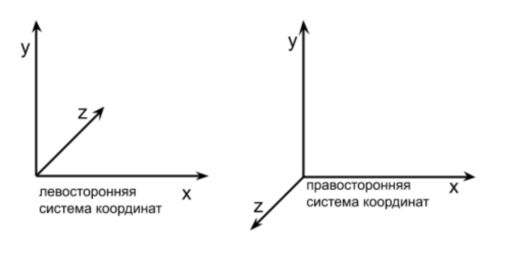

## Мировое пространство

В рамках окружающего мира все объекты являются трёхмерными, а значит любой помещённый в данное пространство объект определён в некоторой системе координат. В компьютерной трёхмерной графике для определения пространства используется ДПСК, имеющая соответственно известные Вам три компоненты: X, Y и Z - ортогональные друг относительно друга и определюящие координаты любого объекта в данном пространстве единственным образом.

### Виды пространств

Координатное пространство можно охарактеризовать по направлению аппликаты, а именно - оно может быть левосторонним (чем больше Z, тем дальше расположен объект), либо правосторонним (чем меньше Z, тем дальше объект).



В Direct3D, например, принята левосторонняя система координат, а в OpenGL - правосторонняя: для нас это особой роли пока не играет. Просто полезный факт. Но если Вы в будущем планируете заниматься компьютерной графикой, то нужно учитывать принятую модель в инструментариях для 3D моделлирования, иначе возникнут расхождения при импорте этих самых моделей.

Помимо этого, существует пять обычно используемых в КГ видов пространств: объекта (object space), мировое (world space), видовое (view space), проекционное (projection space) и пространство экрана (screen space).

Пространство объекта задаёт соответственно пространство, центрированное относительно объекта, т.е. объект находится всегда в позиции с координатами (0, 0, 0). Наиболее часто используемо это пространство для создания 3D моделей.

Пространство мира куда более глобально и описывает положение объектов друг относительно друга в этом самом пространстве, а все объекты расположены относительно точки (0, 0, 0) являющейся центром мирового пространства.

Видовое пространство - пространство камеры, где она помещена в начальную точку, ось Y направлена вверх, а ось Z - вдаль от камеры. При движении всего пространства создаётся ощущение движения камеры, но на деле - всё наоборот.

Проекционное пространство определяет видимость объектов - объекты попадающие на него отображаются на экране и геометрически такое пространство представляет собой усечённую пирамиду, имеющую соответственно шесть плоскостей.

Пространство экрана - единственное из данных двухмерное пространство - с ним Вы знакомились в прошлом семестре - оно определяет то, что будет показано на экране. Начальная точка всегда привязана к крайнему левому углу экрана, ось X направлена вправо, а ось Y - вниз. При этом самая дальняя от начальной точка имеет координату (width - 1, height - 1).

### Трансформации пространства к пространству

Трансформации пространств используются всегда с целью привести одно пространство к другому. В рамках КГ - отобразить набор объектов на экран.

Весь набор действий - несмотря на количество видов пространств, строго говоря, простой: мировая матрица задаёт положение объектов друг относительно друга; камера которая отображает нам объекты задаётся видовой матрицей, а проекционная отсекает всё, что мы не видим, а также отвечает за корректное отображение - удалённые от нас объекты кажутся меньшими по сравнению с теми, что вблизи камеры (строго говоря, это перспективная проекция, которую Вы можете наблюдать в реальном мире, но помимо неё встречается ещё несколько видов проекций, среди которых есть, например, ортогональная, отображающая всё таким образом, что удалённые объекты выглядят по размеру такими же, что и ближайшие). 

В прошлой лабораторной работе мы отрисовывали двухмерный треугольник в трёхмерном пространстве, а теперь будем отрисовывать трёхмерный куб, как самый простой примитив.

Для начала добавим в определение вершины компоненту цвета (```Vertex.hpp```):

```c++
struct Vertex {
		DirectX::XMFLOAT3 Position;
		DirectX::XMFLOAT4 Color;
};
```

Далее, в класс рендера добавим несколько изменений:

```c++
#include <directxmath.h>

// ...

class Render : public IRender {
private:
	//...

	DirectX::XMMATRIX   m_WorldSpace;
	DirectX::XMMATRIX   m_ViewSpace;
	DirectX::XMMATRIX   m_ProjectionSpace;

	ID3D11Buffer*       m_IndexBuffer;
	ID3D11Buffer*       m_ConstantBuffer;

	//...
public:
	//...

	void* operator new(std::size_t i) {
		return _aligned_malloc(i, 0x10); // 0x10 == 16
	}

	void  operator delete(void* ptr) {
		_aligned_free(ptr);
	}
};
```

Мы добавили три матрицы, задающие соответствующие проекции пространств и отвечающие за преобразование пространства к пространству, а также два буфера, среди которых индексный - он используется для оптимизации затрат памяти при работе с трёхмерными объектами, а также для удобства. То есть у нас есть коллекция вершин, который сопоставлен индекс - у каждой вершины в данной коллекции свой индекс, позволяющий нам через один индекс, а не использование трёх её вершин оперировать этой самой вершиной.

Константные буферы используется для передачи данных в шейдер, а именно трёх матриц проекций. Итоговый результат будет таков, что нам не придётся в вершинном шейдере просчитывать сами матрицы: чем меньше действий делает именно шейдер - тем лучше.

Два перегруженных оператора управления памятью нам необходимы для корректной работы с библиотекой DirectX Math. Связано это с тем, что библиотека отличается крайне высокой скоростью работы, но достигается это использованием интринсиков (intrinsic functions), в основе которых использование SIMD, что позволяет обрабатывать данные в 128-битных регистрах, добиваясь параллельной обработки данных почти за то же время. Но все эти операции чувствительны к выравниванию памяти по 16 байт.

Внесите соответствующие изменения по инициализации двух новых буферов в конструктор и внестие изменения в метод ```Close```:

```c++
void Render::Close(void) {
	CG_RELEASE(this->m_ConstantBuffer);
	CG_RELEASE(this->m_Buffer);
	CG_RELEASE(this->m_IndexBuffer);
	//...
}
```

Теперь необходимо внести изменения в метод инициализации рендера. Среди изменений будет определение входного формата, которому добавится ещё и описание цвета для вершины в формате RGBA, а также соответствующие изменения в сам временный буфер вершин, в который теперь добавится ещё и 4-мерный вектор для описания цвета (цвета и положение вершин Вы можете изменить на своё усмотрение, главное, чтобы они были согласованы):

```c++
bool Render::Init(HWND nwnd) {
	//...

	// определение входного формата
	D3D11_INPUT_ELEMENT_DESC layout[] {
		{ "POSITION", 0x0, DXGI_FORMAT_R32G32B32_FLOAT,    0x0, 0x0, D3D11_INPUT_PER_VERTEX_DATA, 0x0 },
		{ "COLOR",    0x0, DXGI_FORMAT_R32G32B32A32_FLOAT, 0x0, 0xC, D3D11_INPUT_PER_VERTEX_DATA, 0x0 } // 0xC == 12
	};
	
	//...

	// Создание буфера вершин
	Vertex vertices[]  {
		{ DirectX::XMFLOAT3(-1.0f,  1.0f, -1.0f), DirectX::XMFLOAT4(0.0f, 0.0f, 1.0f, 1.0f) },
		{ DirectX::XMFLOAT3( 1.0f,  1.0f, -1.0f), DirectX::XMFLOAT4(0.0f, 1.0f, 0.0f, 1.0f) },
		{ DirectX::XMFLOAT3( 1.0f,  1.0f,  1.0f), DirectX::XMFLOAT4(0.0f, 1.0f, 1.0f, 1.0f) },
		{ DirectX::XMFLOAT3(-1.0f,  1.0f,  1.0f), DirectX::XMFLOAT4(1.0f, 0.0f, 0.0f, 1.0f) },
		{ DirectX::XMFLOAT3(-1.0f, -1.0f, -1.0f), DirectX::XMFLOAT4(1.0f, 0.0f, 1.0f, 1.0f) },
		{ DirectX::XMFLOAT3( 1.0f, -1.0f, -1.0f), DirectX::XMFLOAT4(1.0f, 1.0f, 0.0f, 1.0f) },
		{ DirectX::XMFLOAT3( 1.0f, -1.0f,  1.0f), DirectX::XMFLOAT4(1.0f, 1.0f, 1.0f, 1.0f) },
		{ DirectX::XMFLOAT3(-1.0f, -1.0f,  1.0f), DirectX::XMFLOAT4(0.0f, 0.0f, 0.0f, 1.0f) }
	};

	// Создаём буффер, который будет хранить вершины
	//...

	// Устанавливаем топологию примитива
	//...

	// Установка индексного буфера
	WORD indices[] {
		0x3, 0x1, 0x0,
		0x2, 0x1, 0x3,

		0x0, 0x5, 0x4,
		0x1, 0x5, 0x0,

		0x3, 0x4, 0x7,
		0x0, 0x4, 0x3,

		0x1, 0x6, 0x5,
		0x2, 0x6, 0x1,

		0x2, 0x7, 0x6,
		0x3, 0x7, 0x2,

		0x6, 0x4, 0x5,
		0x7, 0x4, 0x6,
	};
	bd.Usage          = D3D11_USAGE_DEFAULT;
	bd.ByteWidth      = sizeof(WORD) * 0x24;  // 0x24 == 36
	bd.BindFlags      = D3D11_BIND_INDEX_BUFFER;
	bd.CPUAccessFlags = 0x0;
	Data.pSysMem      = indices;
	sc = m_D3DDevice->CreateBuffer(&bd, &Data, &m_IndexBuffer);
	if (FAILED(sc)) {
		return false;
	}	

	m_ImmediateContext->IASetIndexBuffer(m_IndexBuffer, DXGI_FORMAT_R16_UINT, 0x0);

	m_ImmediateContext->IASetPrimitiveTopology(D3D11_PRIMITIVE_TOPOLOGY_TRIANGLELIST);


	// Создание константного буфера
	bd.Usage          = D3D11_USAGE_DEFAULT;
	bd.ByteWidth      = sizeof(ConstantBuffer);
	bd.BindFlags      = D3D11_BIND_CONSTANT_BUFFER;
	bd.CPUAccessFlags = 0x0;
	sc = m_D3DDevice->CreateBuffer(&bd, nullptr, &m_ConstantBuffer);
	if (FAILED(sc)) {
		return false;
	}


	// Инициализация матриц пространств
	this->m_WorldSpace = DirectX::XMMatrixIdentity();                       // Задаём мировую матрицу

	DirectX::XMVECTOR Eye = DirectX::XMVectorSet(0.0f, 1.0f, -5.0f, 0.0f);
	DirectX::XMVECTOR At  = DirectX::XMVectorSet(0.0f, 1.0f, 0.0f, 0.0f);
	DirectX::XMVECTOR Up  = DirectX::XMVectorSet(0.0f, 1.0f, 0.0f, 0.0f);
	this->m_ViewSpace     = DirectX::XMMatrixLookAtLH(Eye, At, Up);         // .. видовую матрицу (камеру)

	float width  = 640.0f;
	float height = 480.0f;
	// и матрицу проекционную
	this->m_ProjectionSpace = DirectX::XMMatrixPerspectiveFovLH(DirectX::XM_PIDIV2, width / height, 0.01f, 100.0f);

	return true;
}
```

Помимо изменений в описании входного формата, мы изменили буфер вершин, в который теперь включена ещё одна 4-мерная компонента для каждой вершины, описывающая цвет.
После этого мы создаём индексный буфер, или же буфер индексов, который хранит информацию о треугольниках, позволяя нам оперировать куда более меньшим набором памяти для описания трёзмерных объектов (Например, для описания куба нам понадобится всего шесть вершин в индексном буфере, комбинируя которые мы сможем отрисовать куб из треугольников его составляющих).
Выделяем для него память и указываем, что буфер является именно индексным. А после - связываем его с контекстом. 

Примерно по такому же принципу мы создаём и константный буфер, который служит для передачи данных из Вашего приложения в шейдер. Чуть позже Вы увидите каким образом это происходит.

И ещё чуть ниже располагается инициализация матриц пространств. Для проекционной матрицы мы указываем разницу ширины и высоты экрана, ближнюю грань, как ```0.01f``` и дальнюю, как ```100.0f```. Всё что не попадёт в такие границы от видовой матрицы отрисовано не будет

На данном этапе VS будет подсвечивать Вам ошибкой строку с указанием размерности константого буфера, потому что как таковой он нами ещё не определён.
Давайте сделаем это в файле с определением вершины. Чуть ниже определения ```Vertex``` добавьте:

```c++
	struct ConstantBuffer {
		DirectX::XMMATRIX World;
		DirectX::XMMATRIX View;
		DirectX::XMMATRIX Projection;
	};
```

Как Вы можете заметить, в шейдер мы будем передавать матрицы пространств, для формирования изображения в нём.

### Отрисовка

Вносим изменения в метод отрисовки: пока нам не очень важно, что это плохо с точки зрения архитектуры - нам важно понять сам принцип работы.

```c++
bool Render::Draw(void) {
	static float t = 0.0f;
	static DWORD dwTimeStart = 0x0;
	DWORD dwTimeCur = GetTickCount();
	if (dwTimeStart == 0x0) {
		dwTimeStart = dwTimeCur;
	}
	t = (dwTimeCur - dwTimeStart) / 1000.0f;

	this->m_WorldSpace = DirectX::XMMatrixRotationY(t);

	ConstantBuffer cb;
	cb.World      = DirectX::XMMatrixTranspose(this->m_WorldSpace);
	cb.View       = DirectX::XMMatrixTranspose(this->m_ViewSpace);
	cb.Projection = DirectX::XMMatrixTranspose(this->m_ProjectionSpace);
	m_ImmediateContext->UpdateSubresource(m_ConstantBuffer, 0x0, nullptr, &cb, 0x0, 0x0);

	m_ImmediateContext->VSSetShader(m_VertexShader, nullptr, 0x0);
	m_ImmediateContext->VSSetConstantBuffers(0x0, 0x1, &m_ConstantBuffer);
	m_ImmediateContext->PSSetShader(m_PixelShader, nullptr, 0x0);
	m_ImmediateContext->DrawIndexed(0x24, 0x0, 0x0);  // 0x24 == 36

	return true;
}
```

Здесь всё просто - на каждом вызове отрисовки мы просчитываем разницу во времени через тики процесора и вращаем на угол, соответствующий секунде времени.
Далее обновляем данные в константном буфере и передаём эти данные в шейдеры через контекст, а после отрисовываем все 36 индексируемые вершины.

Заметьте, что матрицы перед отправкой в шейдер транспонируются - это требование DX.

### Шейдеры

Теперь нам необходимо написать пиксельный и вершинный шейдеры, которые будут обрабатывать геометрию и цвет, получаемый с вершин через константный буфер.

Напишите следующие пиксельный и вершинный шейдеры (файл назовите ```shader.hlsl```):

```hlsl
cbuffer ConstantBuffer {
	matrix World;
	matrix View;
	matrix Projection;
}

struct VS_OUTPUT {
    float4 Pos   : SV_POSITION;
    float4 Color : COLOR0;
};


VS_OUTPUT VS(float4 Pos : POSITION, float4 color : COLOR) {
    VS_OUTPUT output = (VS_OUTPUT)0x0;
    
    output.Pos   = mul(Pos,        World);
    output.Pos   = mul(output.Pos, View);
    output.Pos   = mul(output.Pos, Projection);
    output.Color = color;
    
    return output;
}

float4 PS(VS_OUTPUT input) : SV_Target {
    return input.Color;
}
```

В начале файла мы описываем выходной формат для шейдеров, который будем использовать - он соответствует тому определению вершины, которое мы задавали в коде проекта: позиция вершины и её цвет, а также константный буфер, который будем принимать, то есть те самые матрицы пространств.
В рамках языка HLSL существуют типы для оперирования уже существующей матрицей и это нам сильно помогает. Мы указываем все три вида матриц проекции.

В вершинном шейдере мы формируем выходной формат для каждой вершины, перемножая все три матрицы последовательно - помните, что умножение матриц некоммутативно, если Вы перемножите матрицы в другом порядке, то получите совершенно иной результат.
В пиксельном мы просто возвращаем цвет вершины, который задавался в коде приложения.


### Задания для самостоятельной работы:
	1. В качестве дополнительного задания - попробуйте изменить порядок перемножения матриц на View * Projection * World или View * World * Projection (а также любой другой вариант перестановки матриц - всего их шесть). Попробуйте объяснить почему происходит именно тот результат, который Вы увидите. 
	>!(Если не можете, то вспомните каким образом формируются пространства - перечитайте соответствующий им раздел в задании выше).

	2. Поменяйте код вращения по нажатию на любые выбранные Вами клавиши, например: стрелки будут задавать вращение по соответствущей оси в нужную сторону.

	3*. Попробуйте задать некоторый другой объект, который хорошо описывается математически, т.е. формулой и отрисуйте его без цвета, или сформируйте логику закрашивания. (Можно также воспользоваться готовой моделью)